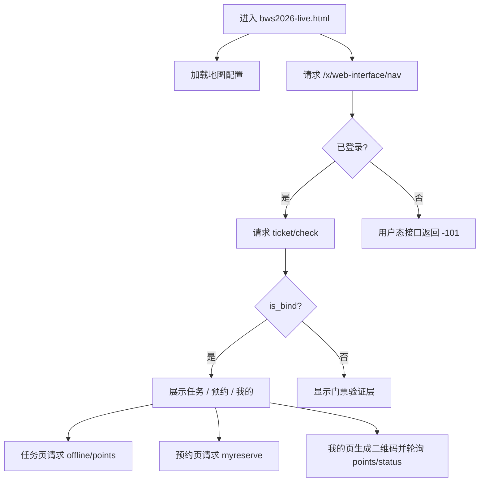

# BWS 2026 Live 页面 API 文档

本文档整理自 `https://www.bilibili.com/blackboard/era/bws2026-live.html#/task` 当前线上前端脚本。

## 基本信息

- **页面标题：** BWS 2026
- **业务页面：** `bws2026-live.html`
- **正式环境活动 ID：** `202601`
- **正式环境 API Host：** `https://api.bilibili.com`
- **活动 API Base：** `https://api.bilibili.com/x/activity/bws`
- **鉴权方式：** B 站 Web 登录态，浏览器请求需携带同站 Cookie

```js
const YEAR = 202601;
const BID = 202601;
const BASE = 'https://api.bilibili.com/x/activity/bws';
```

在浏览器同源页面中请求时：

```js
fetch(url, { credentials: 'include' })
```

未登录时，用户态接口通常返回：

```json
{
  "code": -101,
  "message": "账号未登录",
  "ttl": 1
}
```

## 环境切换

页面通过 `_apiEnv_` 或 URL 中的 `pre-` 判断预发环境：

```js
const apiEnv = new URLSearchParams(location.search).get('_apiEnv_');
const isPre = location.href.includes('pre-') || apiEnv === 'pre';
```

正式环境：

```js
year = 202601;
bid = 202601;
host = 'api.bilibili.com';
```

预发环境：

```js
year = 202602;
bid = 202602;
host = 'pre-api.bilibili.com';
```

## 常量

### 活动日期

```js
const EVENT_DAYS = ['20260710', '20260711', '20260712'];

const DATE_TEXT = {
  20260710: '7月10日',
  20260711: '7月11日',
  20260712: '7月12日'
};
```

### 场馆 ID

```js
const VENUES = [
  { text: '8.1馆', id: 1 },
  { text: '1.1馆', id: 2 },
  { text: '2.1馆', id: 3 },
  { text: '3馆', id: 4 },
  { text: '4.1馆', id: 5 },
  { text: '5.1馆', id: 7 },
  { text: '6.1馆', id: 6 }
];
```

### 分区映射

```js
const ZONE_ORDER = {
  'UP主空间': 1,
  '不止动画': 2,
  '棋魂英雄': 3,
  '虚拟乐园': 4,
  '游戏世界': 5,
  '恋恋心声': 6,
  '梦幻集市': 7,
  '一起桌游': 8,
  '痛无止境': 9
};
```

## 接口总览

| 用途 | Method | URL |
|---|---:|---|
| 当前登录用户 | GET | `https://api.bilibili.com/x/web-interface/nav` |
| 地图与展位配置 | GET | `https://api.bilibili.com/x/activity_components/eva_operation/list?source_id=29ERA1wloghvj7u00` |
| 活动静态配置 | GET | `https://api.bilibili.com/x/activity_components/eva_operation/list?source_id=29ERA1wloghvj8s00` |
| 服务端时间 | GET | `${BASE}/online/park/server/time?year=202601` |
| 门票绑定校验 | GET | `${BASE}/online/park/ticket/check?year=202601` |
| 乐园任务列表 | GET | `${BASE}/offline/points?bid=202601&fid=<fid>&day=<day>&year=202601` |
| 我的预约 | GET | `${BASE}/online/park/myreserve?year=202601` |
| 我的实名信息 | GET | `${BASE}/online/my/info?year=202601` |
| 打卡奖励状态 | GET | `${BASE}/online/park/points/status?year=202601` |

## 当前登录用户

### 基本信息

- **Method:** GET
- **URL:** `https://api.bilibili.com/x/web-interface/nav`
- **Auth:** 需要 Web 登录态

### 页面用途

用于获取当前用户登录状态和基础资料。页面会读取 `mid` 生成个人二维码。

### 响应字段

| 字段 | 类型 | 说明 |
|---|---|---|
| `data.isLogin` | boolean | 是否登录 |
| `data.mid` | number | 用户 ID |
| `data.uname` | string | 用户昵称 |
| `data.face` | string | 用户头像 |

### 未登录响应示例

```json
{
  "code": -101,
  "message": "账号未登录",
  "data": {
    "isLogin": false
  }
}
```

## 地图与展位配置

### 基本信息

- **Method:** GET
- **URL:** `https://api.bilibili.com/x/activity_components/eva_operation/list?source_id=29ERA1wloghvj7u00`
- **Auth:** 当前观察不强制登录

### 页面用途

用于地图渲染、展位定位、任务点和预约活动跳转到地图位置。

### 主要结构

接口返回的核心数据位于：

```js
data.list[0].properties
```

字段示例：

| 字段 | 类型 | 说明 |
|---|---|---|
| `blockList` | array | 地图障碍区域 |
| `booth` | array | 展位列表 |
| `classify` | array | 展位分类 |
| `gridSize` | number | 地图网格尺寸 |
| `mapSize` | object | 地图尺寸 |
| `mapTiles` | array | 地图瓦片 |
| `venue` | array | 场馆列表 |
| `zone` | array | 分区列表 |

### 展位字段

页面使用到的展位字段：

| 字段 | 类型 | 说明 |
|---|---|---|
| `boothCode` | string | 展位编号 |
| `name` | string | 展位名称 |
| `venue` | string | 所属场馆 ID |
| `zone` | string | 所属分区 ID |
| `classify` | string[] | 分类 ID 列表 |
| `image` | string | 展位图片 |
| `guest` | array | 嘉宾信息 |
| `reserves` | array | 可映射的预约或任务 ID |
| `positionInMap` | number[] | 地图网格位置 |
| `sizeInMap` | number[] | 地图网格尺寸 |
| `highPriority` | boolean | 展示优先级 |

### ID 映射逻辑

页面会把 `booth.reserves[].id` 注册为可定位 ID。任务接口里的 `points[].id`、预约接口里的 `reserve_id` 都通过这个映射找到地图展位。

伪代码：

```js
for (const booth of booths) {
  for (const reserve of booth.reserves || []) {
    markers[reserve.id] = boothMarker;
  }
}
```

## 活动静态配置

### 基本信息

- **Method:** GET
- **URL:** `https://api.bilibili.com/x/activity_components/eva_operation/list?source_id=29ERA1wloghvj8s00`
- **Auth:** 当前观察不强制登录

### 页面用途

用于活动配置、Banner、奖品、PDF、任务开放时间等静态配置。

### 响应字段

核心数据位于：

```js
data.list[0].properties
```

字段示例：

| 字段 | 类型 | 说明 |
|---|---|---|
| `awards` | array | 奖品列表 |
| `banners` | array | Banner 列表 |
| `bws_clock_in_day` | string | 打卡相关日期 |
| `bws_event_days` | string | 活动日期，逗号分隔 |
| `bws_golden_finger_day` | string | 活动配置日期 |
| `pdfDate` | string | PDF 更新时间 |
| `pdfUrl` | string | 活动 PDF 地址 |
| `taskDate` | string | 任务开放时间 |

### 示例字段

```json
{
  "bws_event_days": "20260710,20260711,20260712",
  "pdfDate": "2026-07-09 12:00:00",
  "taskDate": "2026-07-09 12:00:00"
}
```

## 服务端时间

### 基本信息

- **Method:** GET
- **URL:** `${BASE}/online/park/server/time?year=202601`
- **Auth:** 需要 Web 登录态

### 页面用途

用于判断当前活动日期、抽奖是否结束、签到弹窗日期等。

### 请求参数

| 参数 | 类型 | 必填 | 说明 |
|---|---|---:|---|
| `year` | number | 是 | 活动 ID，正式环境为 `202601` |

### 响应字段

| 字段 | 类型 | 说明 |
|---|---|---|
| `data.server_time` | number/string | 服务端时间戳，页面会转换为毫秒 |

页面处理逻辑：

```js
const serverTimeMs = Number(data.server_time) * 1000;
```

## 门票绑定校验

### 基本信息

- **Method:** GET
- **URL:** `${BASE}/online/park/ticket/check?year=202601`
- **Auth:** 需要 Web 登录态

### 页面用途

判断是否完成门票信息验证。未绑定时，任务页、预约页、我的页会显示「请先完成门票信息验证」。

### 请求参数

| 参数 | 类型 | 必填 | 说明 |
|---|---|---:|---|
| `year` | number | 是 | 活动 ID |

### 响应字段

| 字段 | 类型 | 说明 |
|---|---|---|
| `data.is_bind` | boolean | 是否完成门票绑定 |

页面处理逻辑：

```js
isBind = Boolean(data.is_bind);
```

## 乐园任务列表

### 基本信息

- **Method:** GET
- **URL:** `${BASE}/offline/points?bid=202601&fid=<fid>&day=<day>&year=202601`
- **Auth:** 需要 Web 登录态

### 页面用途

用于「乐园任务」页展示任务列表、任务进度、打卡状态。

### 请求参数

| 参数 | 类型 | 必填 | 说明 |
|---|---|---:|---|
| `bid` | number | 是 | 活动 ID，正式环境为 `202601` |
| `fid` | number | 是 | 场馆 ID |
| `day` | string | 是 | 日期。可为单日，也可为逗号拼接 |
| `year` | number | 是 | 活动 ID，正式环境为 `202601` |

### 请求示例

```text
GET /x/activity/bws/offline/points?bid=202601&fid=1&day=20260710&year=202601
```

一次请求多个日期：

```text
GET /x/activity/bws/offline/points?bid=202601&fid=1&day=20260710,20260711,20260712&year=202601
```

### 响应结构

页面按如下结构读取：

```js
data.points_list[day].points
data.points_list[day].task.total
data.points_list[day].task.cur_count
```

### 任务进度字段

| 字段 | 类型 | 说明 |
|---|---|---|
| `task.total` | number | 总任务数 |
| `task.cur_count` | number | 当前已完成任务数 |

### 任务点字段

| 字段 | 类型 | 说明 |
|---|---|---|
| `id` | string/number | 任务点 ID，用于映射地图展位 |
| `name` | string | 任务点名称 |
| `image` | string | 任务点图片 |
| `unlocked` | number | 奖励乐园币数量 |
| `is_point` | boolean/number | 是否已打卡 |
| `dic` | string | 任务说明文案 |

### 页面行为

- `is_point` 为真时显示「已打卡」。
- `is_point` 为假时显示「去打卡」。
- 点击「去打卡」不会直接请求打卡接口，而是跳转到地图中对应展位。
- 地图定位通过任务点 `id` 匹配地图配置中的 `booth.reserves[].id`。

## 我的预约

### 基本信息

- **Method:** GET
- **URL:** `${BASE}/online/park/myreserve?year=202601`
- **Auth:** 需要 Web 登录态

### 页面用途

用于「我的预约」页展示当前用户预约的活动场次，并支持跳转到地图展位。

### 请求参数

| 参数 | 类型 | 必填 | 说明 |
|---|---|---:|---|
| `year` | number | 是 | 活动 ID |

### 响应结构

页面按日期分组读取：

```js
data.reserve_list[date]
```

例如：

```js
data.reserve_list['20260710']
```

### 预约项字段

| 字段 | 类型 | 说明 |
|---|---|---|
| `order_id` | string/number | 订单或记录 ID |
| `reserve_id` | string/number | 预约活动 ID，用于映射地图展位 |
| `reserve_no` | string | 我的预约编号 |
| `act_title` | string | 活动标题 |
| `act_img` | string | 活动图片 |
| `act_begin_time` | number | 活动开始时间，秒级时间戳 |
| `act_type` | string/number | 活动类型，可能为逗号分隔 |
| `online_state` | number | 活动状态 |
| `describe_info` | string | 活动说明 |

### 状态文案

```js
const STATUS_TEXT = {
  0: 'GO',
  1: '已完成',
  2: '已结束',
  3: 'GO'
};
```

页面逻辑：

```js
const state = isOver ? 2 : item.online_state;
```

当状态为 `0` 或 `3` 时，点击按钮会跳转到地图展位。

## 我的实名信息

### 基本信息

- **Method:** GET
- **URL:** `${BASE}/online/my/info?year=202601`
- **Auth:** 需要 Web 登录态

### 页面用途

用于「我的」页展示实名信息中的证件号。页面默认打码，可点击眼睛图标切换显示。

### 请求参数

| 参数 | 类型 | 必填 | 说明 |
|---|---|---:|---|
| `year` | number | 是 | 活动 ID |

### 响应字段

| 字段 | 类型 | 说明 |
|---|---|---|
| `data.zhengjianhao` | string | 证件号 |

页面默认展示：

```js
'*'.repeat(18)
```

## 打卡奖励状态

### 基本信息

- **Method:** GET
- **URL:** `${BASE}/online/park/points/status?year=202601`
- **Auth:** 需要 Web 登录态

### 页面用途

用于「我的」页轮询打卡奖励状态。页面可见且当前路由为 `me` 时，每 3 秒轮询一次。

### 请求参数

| 参数 | 类型 | 必填 | 说明 |
|---|---|---:|---|
| `year` | number | 是 | 活动 ID |

### 响应字段

| 字段 | 类型 | 说明 |
|---|---|---|
| `data.point_id` | number | 打卡点 ID |
| `data.reward_num` | number | 获得的乐园币数量 |

### 页面逻辑

当 `point_id` 和 `reward_num` 都是非 0 数字时，页面弹出获得乐园币提示：

```js
if (Number(point_id) !== 0 && Number(reward_num) !== 0) {
  showCheckInPopup(reward_num);
}
```

同一天同一个 `point_id` 只弹一次，前端通过 `localStorage` 记录：

```text
bws-live-checkin-popup:<mid>:<YYYYMMDD>:<point_id>
```

## 个人二维码

个人二维码不是接口直接返回，而是前端本地生成。

### 数据来源

先通过当前登录用户接口获取：

```js
mid = nav.data.mid;
```

### 二维码内容

页面会把 `mid` 加密后拼到当前活动页：

```text
https://www.bilibili.com/blackboard/era/bws2026-live.html?key=<encryptedMid>
```

### 加密参数

前端使用 AES-CBC：

```js
key = 'f2CmYe*nls&MW*75';
iv = '7VKmLf4NvGO#83Y@';
mode = CBC;
padding = Pkcs7;
```

伪代码：

```js
const encrypted = AES.encrypt(String(mid), key, {
  iv,
  mode: CBC,
  padding: Pkcs7
}).toString();

const qrUrl = `https://www.bilibili.com/blackboard/era/bws2026-live.html?key=${encodeURIComponent(encrypted)}`;
```

二维码通过前端 Canvas 绘制，不依赖后端二维码接口。

## 抽奖组件

任务页中的押宝/抽奖区域由通用活动组件渲染，不在当前页面直接写具体业务接口。

页面调用：

```js
segmentStartRender({
  pageId,
  container
});
```

正式环境 Page ID：

```js
const LOTTERY_PAGE_ID = {
  20260710: '3ERAcwloghvwv500',
  20260711: '3ERAxwloghv08x00',
  20260712: '3ERAcwloghvqk700'
};
```

预发环境 Page ID：

```js
const PRE_LOTTERY_PAGE_ID = {
  20260710: '3ERAxwloghv09100',
  20260711: '3ERAcwloghvqt600',
  20260712: '3ERAcwloghvqqo00'
};
```

## 页面初始化流程



## 前端路由与接口关系

| 路由 | 页面 | 主要接口 |
|---|---|---|
| `#/map` | 地图 | 地图配置接口 |
| `#/task` | 乐园任务 | `server/time`、`offline/points`、抽奖组件 |
| `#/reservation` | 我的预约 | `server/time`、`myreserve` |
| `#/me` | 我的 | `nav`、`online/my/info`、`points/status` |

## 调试用请求示例

```js
const BASE = 'https://api.bilibili.com/x/activity/bws';

async function requestJson(url) {
  const res = await fetch(url, { credentials: 'include' });
  return res.json();
}

await requestJson(`${BASE}/online/park/ticket/check?year=202601`);

await requestJson(
  `${BASE}/offline/points?bid=202601&fid=1&day=20260710&year=202601`
);

await requestJson(`${BASE}/online/park/myreserve?year=202601`);

await requestJson(`${BASE}/online/my/info?year=202601`);

await requestJson(`${BASE}/online/park/points/status?year=202601`);
```

## 注意事项

- 用户态接口依赖真实登录态和服务端资格校验。
- 门票验证由 `/online/park/ticket/check` 控制，不是前端遮罩。
- 任务打卡按钮本身不直接请求打卡接口，而是跳转地图展位。
- 个人二维码由前端基于 `mid` 本地生成，但实际核验仍由服务端完成。
- `_apiEnv_=pre` 会切换到预发环境，不适合读取正式活动数据。
